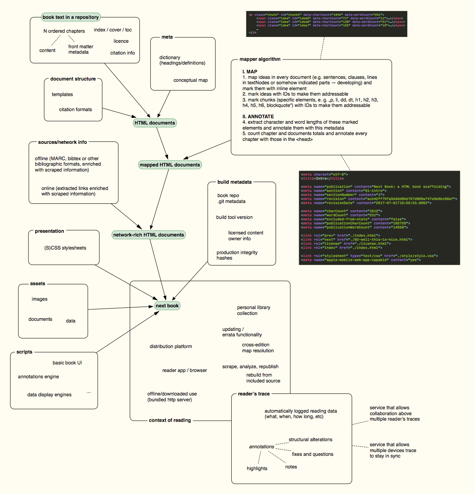

# next-book / Lawrence Lessig: Free Culture

See the book at [next-book.github.io/free-culture/][book].

## Okay, what's this? 🤔

**This edition of Free Culture is built upon [next-book](nb-builder) — a piece of software exploring the shape of a book in a digital environment (along with all those *hows*, *whys* and *whats*). Instead of replicating the paper experience, we try to move forward beyond paper, embracing the networked digital environment.**

Republishing a book that originated in print may feel wrong in this exploratory pursuit, but it puts emphasis on continuity. Text as a medium is more than the object that contains it: it's reading experience, communication platform, the publishing process, personal and social knowledge reservoir, learning tool etc. All these aspects are interwoven. 

We need to work carefully while keeping our tools as sharp as it gets.

*Why Lessig's Free Culture?* It's a book about a topic that touches *the digital* from another but similarly relevant and interconnected perspective. When we stop trying to map new problems on existing models, the world may start changing.

**Note:** *We started in fall 2016 with a research of current solutions and short/long term goals of their maintainers and decided to find another way. We value accessibility and standardization efforts in EPUB community, but at that time there weren't many signs of opening up to the [web](http://info.cern.ch/Proposal.html). There's a lot going on now and we believe this code might be a way to express our ideas. Of course, there's a lot to be said, written and discussed. Please see all this as a contribution to a discussion.*

## Some ideas 😮

This is basic idea behind the “next-book” publication process. Some might draw an analogy to [TeX](https://en.wikipedia.org/wiki/TeX), but the focus is not on the typography (that's a browser's problem): *next-book tries to deliver a focused reading experience in networked environment*.

Right now, the “network enrichment” is not implemented in the code at all (this is tied not only to implementation but also to licensing). A lot of the functionality is just drafted in code. There is a basic implementation of the reader's trace interaction, but none of the exchange APIs, distribution systems etc.

There's a lot to think of when you leave the “normal world” — authoring tools and formats, reading experience and devices, distribution platforms, personal and public libraries etc. There's also a lot that becomes simpler, e. g. if you accept generic browser as your platform (it is currently optimized for some specific uses, but let's think how this use case may shape even the browser itself). 

Read more about this in articles about [Next Book](https://jan-martinek.com/articles/the-next-book) and [what can we learn from how pagination is used in print](https://jan-martinek.com/articles/talkin-bout-pagination). (More to come.)

## Current shape 😳

Exploratory nature permeates this project: eventually, we'd like to have a production level package on our hands, but right now it's a bit mess (a welcome one).

This is living result of a prototyping process and ideas go into the code, shape the output, hit the walls and evolve: the code is the spec right now and it changes dramatically. After a functionalities stabilize, specs and tests will come and major refactoring will be done, but *let's talk a lot about it first*.

Some notes on the current status of the codebase (this repo + [nb-builder] that produces the [result][book]):

- Generally:
    - *The process of book building is not definite and may be broken into standalone* parts — instead of working up from Markdown and templates you may want to start with a finished HTML, or even apply some parts on the client side.
    - Some affordances are boosted for exploratory purposes (such as on-hover highlighting of *ideas* that *might* be used in future for some interactions).
    - [nb-builder] works with [JSDOM](https://github.com/tmpvar/jsdom) and lots of operations modify this way constructed DOMs. This allows some magic but brings some testing and performance issues.
    - Browser javascript is a mess: buggy, hastily and badly written. The first step is refactoring it into modules and clean it up, then work on improving the experience. Later exporting into standalone packages around the `nb-core.js` providing central API.
    - There's a lot of publishing work that needs to be done on the book itself: interlinks in the footnotes, structure and mapping in the dictionary (half of the terms are currently not mapped into the book), all of the structured bibliography.

- Some more specifics:
    - *Idea mapper is crude*: ES6 regexes do not support unicode, lookbehinds etc. [In future](https://stackoverflow.com/a/30119315/3270421), describing ideas via regexes instead of splitting by separators might make more sense.
    - Dictionary (alphabetical index with definitions) works nicely with a short dictionary that includes definitions (this was the case with the first book we made with next-book). Additionally/concurrently to auto-matching, means of manual markup need to be added.
    - If you want to play with the book at home, you may want to shorten the dictionary, it saves a lot of building time. (I use a 2009 Macbook Pro and it takes *some time* to build.)

**Feel free to discuss anything in the [Github issues here](https://github.com/next-book/free-culture/issues) or at the [nb-builder repo](https://github.com/next-book/nb-builder/issues).**

## Who are we? 👋

We're (for now) just two bookish people based in Prague in a love-hate relationship with their e-readers. [Ivana Lukeš Rybanská](https://github.com/orgs/next-book/people/IvanaRybanska) comes from the publishing world and [Jan Martinek](http://jan-martinek.com) works mostly with text editors and browsers. We both have a *social-sciencey* background.

If you'd like to join our efforts in any way, just tell us. 🙂

## Thanks! 🤘

- Publishing house [Nová Beseda] allowed initial research and experimental development of the first ideas.
- Many thanks go to [Boris Anthony](https://borisanthony.net) for continuing discussions and encouragement!

## License ✍️

Lawrence Lessig released a [PDF version](http://www.free-culture.cc/freecontent) of this book Free Culture under a [Creative Commons (BY-NC 1.0) license](https://creativecommons.org/licenses/by-nc/1.0/). José Menéndez produced and released its [HTML version](http://www.ibiblio.org/ebooks/Lessig/index.html) under the same license.

This HTML version is based on José Menéndez's code and is released under the updated version of the same license [CC BY-NC 4.0](https://creativecommons.org/licenses/by-nc/4.0/).

All code that makes the book work (Javascript, HTML, CSS) may also be considered licensed under an [MIT license](http://opensource.org/licenses/MIT).

[book]: https://next-book.github.io/free-culture/
[nb-builder]: https://github.com/next-book/nb-builder
[Nová beseda]:https://www.novabeseda.cz/page/english
